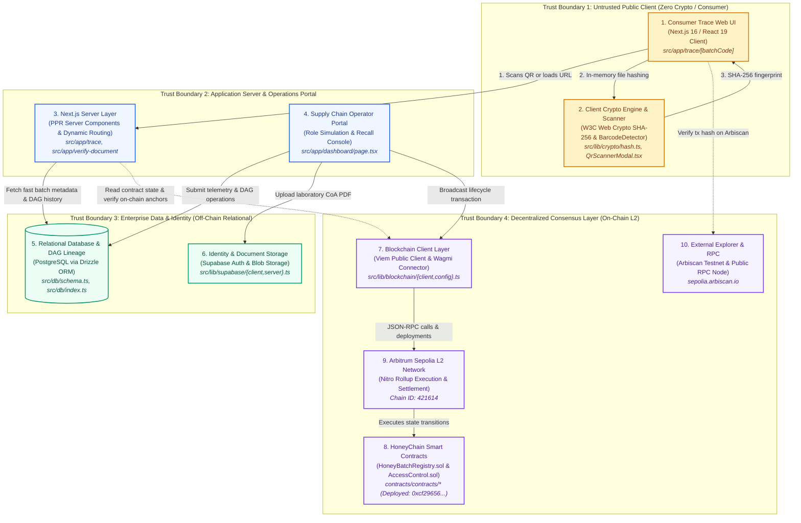

# HoneyChain System Architecture

This document provides a source-grounded architectural specification of the implemented **HoneyChain** platform. It reflects the exact components, data flows, cryptographic mechanisms, and trust boundaries implemented in the repository.

---

## 1. High-Level Architecture Diagram

The diagram below highlights the 10 core architectural components of the implemented system, organized across 4 major trust boundaries.



---

## 2. Core Components & Responsibilities

| # | Component | Primary Files | Role & Technical Responsibility |
|---|---|---|---|
| **1** | **Consumer Trace Web UI** | `src/app/trace/[batchCode]/page.tsx`, `src/components/timeline/JourneyTimeline.tsx`, `src/components/qr/QrCard.tsx` | Renders the public provenance timeline, floral source, harvest region, and status badge. Generates dynamic QR codes matching current `window.location.origin` to ensure zero mobile connection failures. |
| **2** | **Client Crypto Engine & Scanner** | `src/lib/crypto/hash.ts`, `src/components/qr/QrScannerModal.tsx`, `src/components/verifier/DocumentVerifier.tsx` | Performs client-side SHA-256 hashing via `crypto.subtle.digest` with **zero server uploads**. Hosts live camera QR barcode detection via native `BarcodeDetector` / `getUserMedia`. |
| **3** | **Next.js Server Layer** | `src/app/trace/[batchCode]/page.tsx`, `src/app/layout.tsx` | Executes Next.js 16 Server Components with Partial Prerendering (`instant = false`), serving pre-rendered static shells and streaming verified batch data with sub-100ms response times. |
| **4** | **Supply Chain Operator Portal** | `src/app/dashboard/page.tsx` | Internal enterprise interface allowing authenticated actors (Beekeepers, Laboratories, Processors, Admins) to simulate batch creation, record test parameters, and trigger emergency recalls. |
| **5** | **Relational Database & DAG Lineage** | `src/db/schema.ts`, `src/db/index.ts` | PostgreSQL schema managed via Drizzle ORM. Stores high-dimensional metadata (`honey_batches`, `batch_events`, `lab_tests`, `documents`, `recalls`) and models multi-parent/multi-child batch blends and splits via `batch_lineage`. |
| **6** | **Identity & Document Storage** | `src/lib/supabase/client.ts`, `src/lib/supabase/server.ts` | Supabase SSR authentication for operators and secure cloud bucket storage for large raw binary assets (Certificates of Analysis PDFs). |
| **7** | **Blockchain Client Layer** | `src/lib/blockchain/client.ts`, `src/lib/blockchain/config.ts`, `src/lib/blockchain/abi/*` | Typed Viem `publicClient` and Wagmi connector configured for Arbitrum Sepolia. Handles JSON-RPC communication, contract reads, and transaction encoding. |
| **8** | **HoneyChain Smart Contracts** | `contracts/contracts/HoneyBatchRegistry.sol`, `contracts/contracts/HoneyAccessControl.sol` | Solidity 0.8.24 contracts deployed at `0xcf29656Cdcc7D94C3dbAD2eAf204e8FCA129e988`. Implements OpenZeppelin RBAC, batch state machine (`CREATED` -> `TESTED` -> `PROCESSED` -> `PACKAGED` -> `DELIVERED` -> `RECALLED`), document hash anchoring, and emergency recall freezing. |
| **9** | **Arbitrum Sepolia L2 Network** | Chain ID `421614`, Nitro Rollup | High-throughput Ethereum Layer 2 rollup providing fast block times (~250ms) and sub-cent transaction costs, making per-batch supply chain event logging economically viable at scale. |
| **10** | **External Explorer & Public RPC** | `sepolia.arbiscan.io`, `https://sepolia-rollup.arbitrum.io/rpc` | Public verification endpoints. Allows any consumer, auditor, or retailer to independently inspect immutable on-chain event receipts and block timestamps outside the HoneyChain web interface. |

---

## 3. End-to-End Data Flow

```
[Beekeeper] ──(1. Genesis Batch)──> [HoneyBatchRegistry.sol (L2)] ──> [PostgreSQL / Drizzle]
                                                    │
[Lab ISO 17025] ─(2. Test CoA)──> [WebCrypto SHA-256] ──> [L2 Anchor] ──> [Supabase Blob]
                                                    │
[Processor] ───(3. Blend/Split)─> [DAG Lineage] ────> [L2 State] ───> [PostgreSQL DB]
                                                    │
[Packager] ────(4. Label Batch)─> [Generate QR] ────> [Retail Jar]
                                                    │
[Consumer] ────(5. Camera Scan)─> [Next.js Trace UI] <── [Verify Hashes & Arbiscan Link]
```

### Stage 1: Batch Genesis (Apiary Extraction)
1. The authorized Beekeeper logs into the Operator Portal.
2. The harvest event (botanical origin, harvest date, regional coordinates, initial mass) is recorded into `honey_batches`.
3. An on-chain transaction calls `HoneyBatchRegistry.createBatch(batchId, batchCodeHex, ipfsHash)`.
4. The generated transaction hash is indexed into `honey_batches.tx_hash`.

### Stage 2: Laboratory Certification (Isotope Testing)
1. An accredited laboratory tests the sample for C4 sugars, moisture, and HMF (Hydroxymethylfurfural).
2. The laboratory produces a Certificate of Analysis (CoA) PDF.
3. The PDF is hashed in-memory via `src/lib/crypto/hash.ts` (producing an SHA-256 digest).
4. The laboratory calls `HoneyBatchRegistry.recordLabTest(batchId, testType, documentHash, passed)`.
5. The raw PDF is stored in Supabase Storage with its SHA-256 digest indexed in `documents.sha256_hash`.

### Stage 3: Industrial Processing & DAG Lineage (Splits & Blends)
1. In commercial honey handling, multiple hive extractions are blended together or subdivided into jar packaging lines.
2. The processor logs a transformation in `batch_lineage`, defining `parent_batch_id`, `child_batch_id`, and `quantity_contributed_grams`.
3. An on-chain call to `HoneyBatchRegistry.recordTransformation()` anchors the transformation type (`SPLIT` / `MERGE`), cryptographically binding child batches to their parent origins.

### Stage 4: Retail Packaging & Dynamic QR Labeling
1. The packager assigns retail lot numbers and packaging dates.
2. `src/components/qr/QrCard.tsx` renders a high-density QR code embedding the canonical URL:
   `${window.location.origin}/trace/${batchCode}`.
3. The label is printed and adhered to the retail honey jar.

### Stage 5: Consumer QR Verification
1. The consumer scans the jar with a smartphone camera or clicks "Scan Jar QR Code" via `QrScannerModal.tsx`.
2. The browser loads `https://honeychain.vercel.app/trace/HNY-2026-0001`.
3. Next.js App Router fetches batch provenance from PostgreSQL / seed state and renders the `JourneyTimeline`.
4. The consumer clicks "Verify on Arbiscan" to verify the timestamp and signature on Arbitrum Sepolia.
5. To test physical document authenticity, the consumer drags their CoA PDF into `DocumentVerifier.tsx`, which recalculates the SHA-256 digest locally and compares it with the on-chain laboratory anchor.

---

## 4. Blockchain Role: On-Chain vs. Off-Chain Separation

To optimize throughput and avoid unnecessary gas expenses, HoneyChain strictly partitions data between the relational store and the Layer 2 rollup:

| Data Attribute | Storage Location | Rationale |
|---|---|---|
| **Batch Status Enum** (`CREATED`, `TESTED`, `PROCESSED`, `PACKAGED`, `RECALLED`) | **On-Chain** (`HoneyBatchRegistry.sol`) | Single source of authoritative truth for batch state. Prevents retroactively masking recalls. |
| **Document SHA-256 Fingerprint** (`bytes32 documentHash`) | **On-Chain** (`HoneyBatchRegistry.sol`) | Tamper-evident proof that physical PDF reports have not been altered by a single byte. |
| **Actor Authorization & Roles** (`AccessControl`) | **On-Chain** (`HoneyAccessControl.sol`) | Cryptographically enforces that only certified beekeepers, labs, and processors can sign events. |
| **Parent/Child Batch Hash Lineage** | **On-Chain** (`HoneyBatchRegistry.sol`) | Guarantees immutable mathematical provenance across supply chain transformations. |
| **Emergency Recall Flag & Timestamp** | **On-Chain** (`HoneyBatchRegistry.sol`) | Immediate on-chain invalidation of adulterated inventory. |
| **High-Volume Telemetry** (ambient temp, weather, hive notes) | **Off-Chain** (`PostgreSQL` / `honey_batches`) | Prohibitive to store on-chain; queries must return in milliseconds. |
| **Large Binary Files** (PDF lab certificates, images) | **Off-Chain** (`Supabase Storage`) | Blockchains are inefficient for blob storage; only the cryptographic hash belongs on-chain. |
| **Full Entity Profiles** (contact email, physical address) | **Off-Chain** (`PostgreSQL` / `organizations`) | Subject to privacy and data protection regulations (GDPR). |

---

## 5. QR Traceability Flow Walkthrough

```
[Physical Honey Jar]
        │
        ▼ (1. Native Camera Scan)
[Smartphone OS] ──> Resolves URL: https://honeychain.vercel.app/trace/HNY-2026-0001
        │
        ▼ (2. HTTP GET)
[Next.js 16 Edge / Server Component]
        │
        ├─> (3a) Reads indexed batch data & DAG lineage from DB
        ├─> (3b) Computes on-chain status and verified Arbiscan link
        │
        ▼ (4. Streamed HTML + Hydration)
[Consumer Mobile Browser]
        │
        ├─> Displays "4 Tiers of Truth" provenance indicators
        ├─> Shows interactive Journey Timeline with GPS locations
        ├─> Provides direct link to on-chain tx on Arbiscan
        └─> Flags immediate red alert if isRecalled == true
```

### Key Technical Safeguards:
1. **Dynamic Origin Resolution**: `QrCard.tsx` binds to `window.location.origin` upon client hydration, preventing hardcoded `localhost` issues across preview, staging, and production deployments.
2. **Graceful Fallback & Fast Prerendering**: Routes utilize static generation with partial dynamic fallbacks (`export const instant = false`) to guarantee instant rendering even under mobile network constraints.
3. **Zero Crypto Barrier**: The verification experience requires no Web3 wallet, browser extension, or token balance from the consumer.

---

## 6. Major Trust Boundaries & Threat Model

```
+───────────────────────────────────────────────────────────────────────────+
| TRUST BOUNDARY 1: Untrusted Public Client (Zero-Privilege)                 |
| - Threat: Malicious consumer, modified browser, forged client-side state.  |
| - Defense: Client only renders data; all cryptographic validation matches |
|   on-chain smart contract state and deterministic SHA-256 hash checks.    |
+───────────────────────────────────────────────────────────────────────────+
                                    │
                                    ▼ (HTTPS / TLS)
+───────────────────────────────────────────────────────────────────────────+
| TRUST BOUNDARY 2: Application Server & Operations Portal                   |
| - Threat: Rogue operator, unauthorized API submissions, server spoofing.   |
| - Defense: Supabase Auth session checks, input sanitization via Zod/Drizzle|
|   type safety, role validation prior to queuing on-chain transactions.     |
+───────────────────────────────────────────────────────────────────────────+
                                    │
                                    ▼ (Encrypted TCP / Pooling)
+───────────────────────────────────────────────────────────────────────────+
| TRUST BOUNDARY 3: Enterprise Data & Identity (Off-Chain Store)            |
| - Threat: Database admin tampering with historical logs.                   |
| - Defense: Any modified historical log fails verification when reconciled  |
|   against the on-chain genesis hash or document hash on Arbitrum Sepolia. |
+───────────────────────────────────────────────────────────────────────────+
                                    │
                                    ▼ (EIP-155 JSON-RPC / Signed TX)
+───────────────────────────────────────────────────────────────────────────+
| TRUST BOUNDARY 4: Decentralized Consensus Layer (Arbitrum Nitro)          |
| - Threat: Unauthorized state mutation, role escalation, batch forgery.   |
| - Defense: Solidity OpenZeppelin AccessControl enforces cryptographic key |
|   ownership. Transactions revert if caller lacks BEEKEEPER_ROLE, etc.     |
+───────────────────────────────────────────────────────────────────────────+
```

